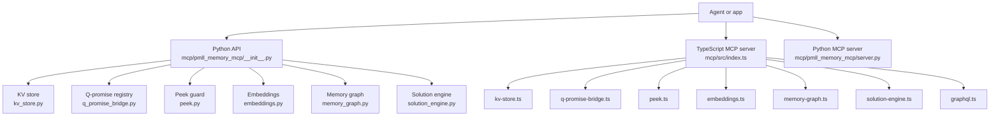
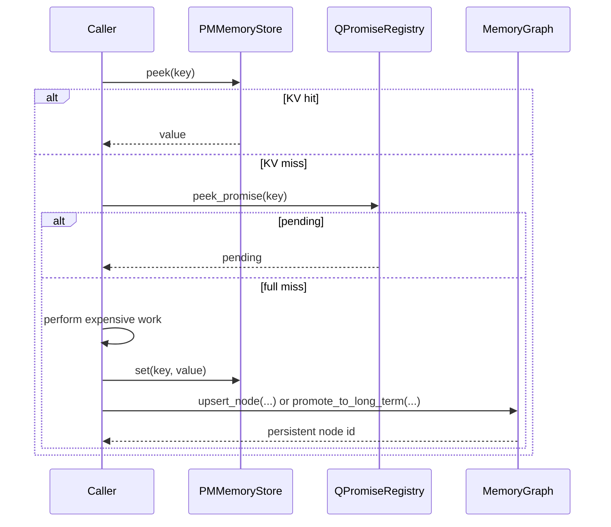

The stable architecture in this repository lives under `mcp/`: a reusable Python package in `mcp/pmll_memory_mcp`, a matching TypeScript implementation in `mcp/src`, and thin server entry points that expose both layers as MCP tools.

## Module Layout

- `mcp/pmll_memory_mcp/__init__.py` is the Python package entry point. It re-exports the reusable classes and functions that matter to application code.
- `mcp/src/index.ts` is the Node entry point. It is primarily a server bootstrapper that wires tools onto `McpServer`.
- `mcp/pmll_memory_mcp/server.py` is the Python MCP wrapper. It mirrors most of the tool surface, but not perfectly.
- `mcp/tests/` is important for understanding intent. The tests confirm session isolation, cache-first resolution, traversal behavior, and long-term promotion.

## Data Flow

The request lifecycle is intentionally layered:

1. A caller starts with a session ID.
2. Short-term lookup happens first through `PMMemoryStore.peek()` or the higher-level `peek_context()`.
3. If there is an in-flight operation, `QPromiseRegistry.peek_promise()` reports a pending state instead of triggering duplicate work.
4. On a miss, the caller performs the expensive work, then stores the result with `set()`.
5. Important results can be promoted into the long-term graph, where `upsert_node()`, `create_relation()`, `search_graph()`, and `retrieve_with_traversal()` operate.
6. `resolve_context()` in `solution_engine.py` always prefers short-term memory and falls back to graph search only when the cache misses.

## Key Design Decisions

### Session-scoped registries instead of global shared memory

`kv_store.py` stores session state in `_session_stores`, and `memory_graph.py` does the same with `_graph_stores`. That isolates independent agent tasks without introducing external databases or cross-task contamination. It also makes the package trivial to test, because each test can clear module state and start fresh.

### Simple in-memory data structures instead of infrastructure dependencies

`embeddings.py` implements TF-IDF and cosine similarity directly rather than depending on a hosted embedding provider. That choice keeps the package runnable in CI, local shells, and air-gapped environments. The trade-off is that semantic quality depends on the local corpus and token overlap, not a pre-trained language model.

### Short-term and long-term layers stay separate until the solution engine

The repo avoids hiding both concerns inside one class. `kv_store.py` and `memory_graph.py` stay independently usable, while `solution_engine.py` performs the policy decision of "short-term first, graph second." That is a clean separation, and it is visible directly in the tests under `mcp/tests/test_solution_engine.py`.

### Server wrappers stay thin

The Python server in `mcp/pmll_memory_mcp/server.py` mostly marshals parameters and returns dicts. The TypeScript server in `mcp/src/index.ts` does the same with `zod` schemas and MCP response envelopes. The actual behavior stays in the lower-level modules, which is why those modules are the right place to read when you need to understand correctness.

## Important Implementation Details

- `PMMemoryStore.set()` is append-like for new keys and in-place for existing keys. Slot indexes stay stable after updates.
- `peek_context()` in both languages checks the KV layer before the promise layer. That means resolved cache hits always win over pending work.
- `memory_graph.py` uses a decayed edge score computed by `_decay_weight()`, then combines that with cosine similarity during traversal. That is why graph results can degrade over time even if node content never changes.
- `add_interlinked_context()` links newly created nodes to each other and then to up to 200 existing nodes. The 200-node cap is a deliberate bound in the source to keep bulk operations from ballooning.

## Source-Level Differences Between Python and TypeScript

One detail worth calling out: the TypeScript server is the canonical 15-tool MCP surface, because it includes the GraphQL tool in `mcp/src/index.ts` and `mcp/src/graphql.ts`. The Python server is close, but it omits GraphQL and renames several wrappers:

- TypeScript: `create_relation`, `prune_stale_links`, `add_interlinked_context`, `retrieve_with_traversal`, `resolve_context`
- Python wrappers: `create_memory_relation`, `prune_memory_links`, `add_interlinked_memory`, `retrieve_memory_traversal`, `resolve_memory_context`

That mismatch is visible in `mcp/src/index.ts` versus `mcp/pmll_memory_mcp/server.py`. If you are documenting or scripting MCP tools, prefer the TypeScript tool names. If you are importing functions in Python, use the reusable package exports from `pmll_memory_mcp`.
