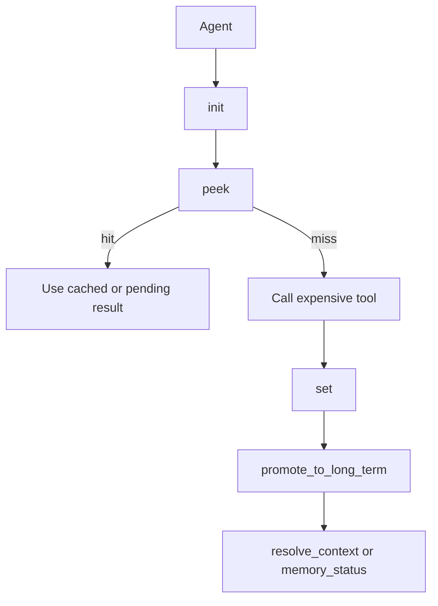

The MCP tool layer is how this package is meant to be used by agents. The core logic lives in reusable modules, but `mcp/src/index.ts` and `mcp/pmll_memory_mcp/server.py` convert that logic into callable MCP tools.

## What It Is

There are two server implementations in the repository:

- TypeScript server: `mcp/src/index.ts`
- Python server: `mcp/pmll_memory_mcp/server.py`

The TypeScript server is the more complete surface. It wires `McpServer`, validates inputs with `zod`, and includes the GraphQL bridge from `mcp/src/graphql.ts`. The Python server uses `FastMCP` and exposes most of the same capabilities as plain tool functions.

## Why It Exists

Most callers do not want to instantiate the low-level objects manually. They want an MCP server that:

- initializes a session
- checks memory before expensive work
- persists important results
- exposes semantic search and traversal tools

The server layer packages those decisions into a tool API.

## How It Relates To Other Concepts

- The short-term tools wrap `PMMemoryStore`, `QPromiseRegistry`, and `peek_context()`.
- The long-term tools wrap `memory_graph.py` or `memory-graph.ts`.
- The solution-engine tools wrap `resolve_context()`, `promote_to_long_term()`, and `get_memory_status()`.

## How It Works Internally

The Node entry point builds a single `server` instance, registers each tool with a schema, and then starts stdio transport in `main()`. The Python entry point uses decorators from `FastMCP` and then calls `mcp.run()` in its own `main()`.

The tool handlers themselves are intentionally thin. For example, the TypeScript `peek` tool simply calls `getStore(session_id)` and then `peekContext(key, session_id, store, _promiseRegistry)`. The Python `peek()` wrapper does the same with the package imports. That is why debugging behavior almost always sends you back into the lower-level modules, not the wrappers.



## Basic Usage

Start the Node server over stdio:

```bash
npx pmll-memory-mcp
```

Or call the Python wrappers directly:

```python
from pmll_memory_mcp.server import init, peek, set, flush

init("session-1", silo_size=256)
print(peek("session-1", "https://example.com"))
set("session-1", "https://example.com", "<html>cached</html>")
print(peek("session-1", "https://example.com"))
print(flush("session-1"))
```

## Advanced Usage

The TypeScript server adds a GraphQL tool that can cache network results inside the short-term store.

```typescript
import { executeGraphQL, GRAPHQL_QUERY } from "./graphql.js";

const result = await executeGraphQL(
  "https://example.com/graphql",
  GRAPHQL_QUERY,
  { first: 10, offset: 0 },
  { Authorization: "Bearer token" },
);

console.log(result.data);
```

## Tool Surface Differences

The two wrappers are close, but not identical:

- The TypeScript server exposes `graphql`; the Python server does not.
- The TypeScript server uses the short names from the core modules: `create_relation`, `prune_stale_links`, `add_interlinked_context`, `retrieve_with_traversal`, `resolve_context`.
- The Python server renames several wrappers to `create_memory_relation`, `prune_memory_links`, `add_interlinked_memory`, `retrieve_memory_traversal`, and `resolve_memory_context`.

<Callout type="warn">If you are publishing an MCP configuration or teaching an agent workflow, use the TypeScript tool names from <code>mcp/src/index.ts</code>. The Python wrapper names are useful for direct imports and tests, but they are not the canonical cross-language contract.</Callout>

<Accordions>
<Accordion title="Why the wrappers stay thin">
The server modules are mostly transport adapters. That keeps business logic in normal package modules where it is easy to test and reuse without a running MCP transport. It also means there is little risk that the Python and TypeScript wrappers drift in algorithmic behavior. The downside is that the wrappers can still drift in naming and coverage, which is exactly what happened with the GraphQL tool and several Python wrapper names.
</Accordion>
<Accordion title="Trade-off of exposing both Python and TypeScript servers">
Shipping both implementations increases reach: Python users get direct imports and FastMCP integration, while Node users get the canonical MCP package published to npm. It also serves as a reference implementation pair, which helps when validating behavior. The cost is documentation and maintenance overhead because the public tool names are not perfectly aligned. Any production integration should standardize on one wrapper instead of mixing both surfaces casually.
</Accordion>
</Accordions>
