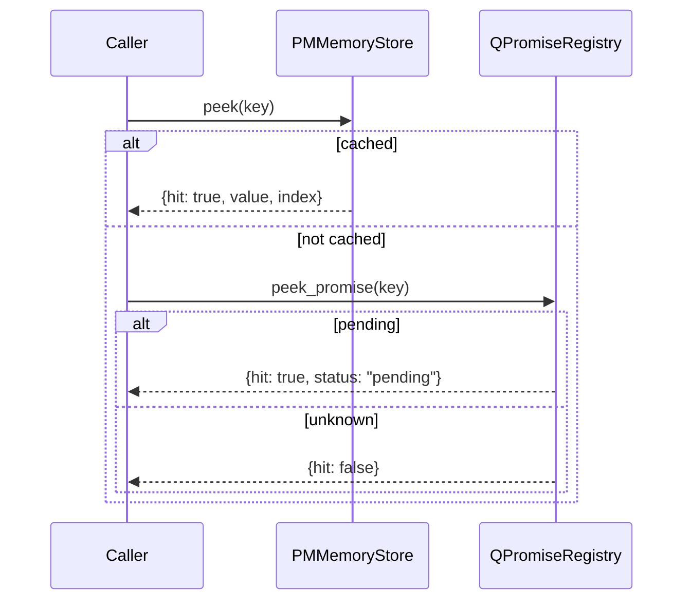

The Q-promise layer exists to answer a different question than the KV silo. The store tells you whether a value is already resolved. `QPromiseRegistry` tells you whether the same work is already in flight, so you can avoid launching a duplicate request.

## What It Is

`QPromiseRegistry` in `mcp/pmll_memory_mcp/q_promise_bridge.py` is a lightweight registry of promise IDs with two states:

- `pending`
- `resolved`

`peek_context()` in `mcp/pmll_memory_mcp/peek.py` combines the registry with `PMMemoryStore` and returns one of three shapes:

- a KV hit
- a pending promise hit
- a full miss

## Why It Exists

Agent systems do not only repeat completed work. They also repeat work that has already started but has not finished yet. Without the pending check, two concurrent subtasks can both miss the cache and both trigger the same expensive action.

## How It Relates To Other Concepts

- It sits directly between the KV silo and the external tool call.
- The TypeScript and Python servers both expose `resolve` wrappers that read from the shared promise registry.
- The semantic graph does not participate in the pending state. It is only a long-term retrieval layer after work has been completed and stored.

## How It Works Internally

`QPromiseRegistry` stores `_QPromise` entries in a dict keyed by `promise_id`. `register()` inserts a new pending record. `resolve()` flips that record to `resolved` and attaches a payload. `peek_promise()` reads the record without removing it, which is why repeated status checks are safe.

`peek_context()` is where the pieces come together. In `peek.py`, the function checks the store first with `store.peek(key)`. Only when the store misses does it query `promise_registry.peek_promise(key)`. That order matters: a resolved cache entry should beat a stale or still-pending promise record.



## Basic Usage

```python
from pmll_memory_mcp import PMMemoryStore, QPromiseRegistry, peek_context

store = PMMemoryStore()
registry = QPromiseRegistry()
registry.register("page:pricing")

print(peek_context("page:pricing", "demo", store, registry))
```

## Advanced Usage

Use a namespaced promise ID so independent sessions do not trample each other.

```python
from pmll_memory_mcp import QPromiseRegistry

registry = QPromiseRegistry()
promise_id = "session-42:search:billing"

registry.register(promise_id)
print(registry.peek_promise(promise_id))

registry.resolve(promise_id, "resolved payload")
print(registry.peek_promise(promise_id))
```

<Callout type="warn">The registry does not namespace promise IDs for you. The source comments in both languages explicitly leave that responsibility to the caller. If you use bare keys like <code>"search"</code> in a multi-session system, you will create false pending hits across unrelated work.</Callout>

<Accordions>
<Accordion title="Why this is a registry instead of real async futures">
The package models the older Q-promise semantics from the C layer rather than exposing Python `asyncio.Future` or JavaScript `Promise` objects directly. That keeps the boundary serializable and easy to expose over MCP tools, where payloads are plain values and statuses. The trade-off is that there is no built-in waiting primitive or callback chain in this Python wrapper. If you need push-based completion, you must layer it on top of the registry yourself.
</Accordion>
<Accordion title="Why peek_context checks the cache before the promise registry">
Checking the resolved cache first makes the hot path deterministic and cheap. If a value has already been committed to the silo, there is no reason to care whether some earlier promise record still exists. That ordering also keeps behavior intuitive for callers who only want the best available answer. The trade-off is that promise cleanup becomes your responsibility if you want the registry itself to stay perfectly tidy.
</Accordion>
</Accordions>
