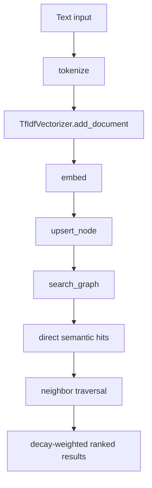

The semantic memory graph is the long-term layer in `pmll-memory-mcp`. It is implemented in `mcp/pmll_memory_mcp/memory_graph.py` and uses `mcp/pmll_memory_mcp/embeddings.py` to build lightweight TF-IDF vectors without any external service.

## What It Is

The graph stores four node types:

- `concept`
- `file`
- `symbol`
- `note`

Edges connect those nodes with typed relationships such as `depends_on`, `references`, and `similar_to`. Searches start with cosine similarity on node embeddings, then expand outward through neighboring edges.

## Why It Exists

Short-term memory is exact and fast, but it disappears when the session ends and only works for exact keys. The graph gives the package a way to keep semantically related knowledge around and retrieve it later even when the query is approximate.

## How It Relates To Other Concepts

- `promote_to_long_term()` writes into the graph from the solution engine.
- `resolve_context()` reads from the graph only after the KV store misses.
- `add_interlinked_context()` can bulk-ingest related concepts and automatically add `similar_to` edges when cosine similarity exceeds `0.72`.

## How It Works Internally

`embeddings.py` tokenizes input locally, adds documents to a module-level `TfIdfVectorizer`, and computes normalized vectors. `memory_graph.py` then stores the vector on each `MemoryNode`. When you call `search_graph()`, the function computes a query vector, scores every node with cosine similarity, sorts the hits, and then calls `_traverse_neighbors()` to explore connected nodes.

Traversal scores are not pure similarity scores. The code blends similarity with decayed edge weight:

```python
relevance = similarity * 0.6 + (edge_decay / max(edge.weight, 0.01)) * 0.4
```

That detail matters because old edges fade over time even if the linked nodes are still semantically close. It lets the graph prefer fresher connections during traversal.



## Basic Usage

```python
from pmll_memory_mcp import upsert_node, create_relation, search_graph

session_id = "graph-demo"
api = upsert_node(session_id, "concept", "API client", "Wraps HTTP requests")
auth = upsert_node(session_id, "concept", "Authentication", "Handles login tokens")
create_relation(session_id, api.id, auth.id, "depends_on")

result = search_graph(session_id, "login client")
print(result.direct[0].node.label)
print(result.total_nodes, result.total_edges)
```

## Advanced Usage

```python
from pmll_memory_mcp import add_interlinked_context, retrieve_with_traversal

session_id = "graph-advanced"
bulk = add_interlinked_context(
    session_id,
    [
        {"type": "file", "label": "server.py", "content": "Registers MCP tools"},
        {"type": "symbol", "label": "resolve_context", "content": "Falls back from cache to graph"},
        {"type": "note", "label": "deployment", "content": "Run over stdio transport"},
    ],
    auto_link=True,
)

start_id = bulk["nodes"][0].id
for item in retrieve_with_traversal(session_id, start_id, max_depth=2):
    print(item.depth, item.node.label, item.relevance_score)
```

<Callout type="warn">`embed()` updates the module-level vectorizer every time you add a document. That means embedding dimensions evolve as the corpus grows. Do not assume vectors generated early in a process are directly comparable to vectors exported from a different process with a different corpus state.</Callout>

<Accordions>
<Accordion title="Why TF-IDF was chosen instead of external embeddings">
The package is explicitly designed to run without Ollama, OpenAI, or another embedding service, as the comments in `embeddings.py` say. That makes installs easy and keeps the server usable in CI and offline environments. The trade-off is retrieval quality: TF-IDF is strong when your query shares vocabulary with stored content, but it is weaker on paraphrases than a neural embedding model. If you need better semantic recall, this is the first subsystem to swap out.
</Accordion>
<Accordion title="Trade-off of auto-linking with a fixed similarity threshold">
`add_interlinked_context()` uses a hard-coded `SIMILARITY_THRESHOLD` of `0.72`. That is easy to reason about and cheap to compute, and it helps the graph become useful with almost no manual edge authoring. The downside is that false positives and false negatives are both possible, especially when documents are short or highly repetitive. In practice, bulk ingestion works best when `content` fields contain meaningful descriptive text instead of bare names.
</Accordion>
</Accordions>
