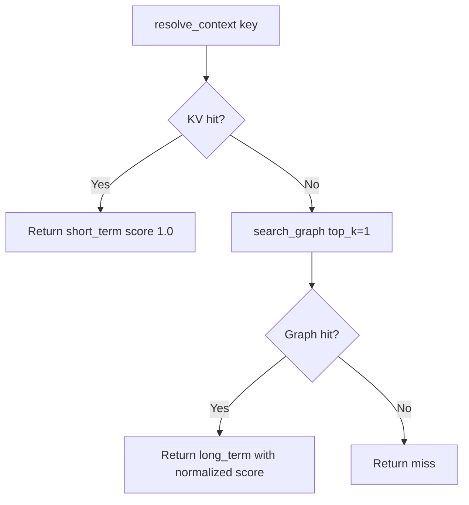

The solution engine in `mcp/pmll_memory_mcp/solution_engine.py` is the policy layer of the package. It decides when to trust the fast session cache, when to fall back to the semantic graph, and how to report the combined state back to callers.

## What It Is

The module exposes three package-level functions:

- `resolve_context()`
- `promote_to_long_term()`
- `get_memory_status()`

Those functions sit above the raw data structures and encode the intended runtime workflow.

## Why It Exists

Without this layer, callers would need to orchestrate every lookup manually:

1. query the KV store
2. query the graph
3. decide which result wins
4. decide what should be promoted
5. compute a combined health view

The solution engine centralizes that policy so both the reusable library and the MCP servers can behave consistently.

## How It Relates To Other Concepts

- It depends on `PMMemoryStore` for short-term lookup.
- It depends on `search_graph()` and `upsert_node()` for long-term work.
- The server wrappers expose it through the TypeScript `resolve_context`, `promote_to_long_term`, and `memory_status` tools, and the Python wrappers with slightly different names.

## How It Works Internally

`resolve_context()` is intentionally simple: it checks `store.peek(key)` first, and only if that misses does it call `search_graph(session_id, key, max_depth=1, top_k=1)`. If there is a graph hit, it returns the top direct hit's `content` and normalizes the score back to a `0.0-1.0` range.

`promote_to_long_term()` does not currently inspect access counts even though the module defines `PROMOTION_THRESHOLD = 3`. The function always calls `upsert_node()` and returns a promoted node ID immediately. That is an important source-level detail: the threshold is part of status reporting, not enforced promotion logic.

`get_memory_status()` asks the graph for stats and combines them with `len(store)` and `store.silo_size`. It is purely observational, which makes it safe to call for dashboards or debug output.



## Basic Usage

```python
from pmll_memory_mcp import PMMemoryStore, resolve_context

store = PMMemoryStore()
store.set("pricing", "cached pricing page")

print(resolve_context("demo", "pricing", store))
```

## Advanced Usage

```python
from pmll_memory_mcp import (
    PMMemoryStore,
    promote_to_long_term,
    get_memory_status,
    resolve_context,
)

session_id = "hybrid"
store = PMMemoryStore()
store.set("auth", "fresh login flow")

promote_to_long_term(session_id, "authentication", "fresh login flow", "concept")
print(resolve_context(session_id, "authentication", store))
print(get_memory_status(session_id, store))
```

<Callout type="warn">`PROMOTION_THRESHOLD` is reported by `get_memory_status()`, but the current implementation does not automatically promote when access count reaches that value. If you need threshold-based promotion, you must build that trigger in your application or extend `promote_to_long_term()` yourself.</Callout>

<Accordions>
<Accordion title="Why short-term results always win">
The source code makes short-term memory authoritative because it represents the most recent task-local state. That is the right default for agent flows where a fresh tool result should override older semantic knowledge. The trade-off is that stale session data can mask a better long-term answer if you forget to refresh or flush the store. When debugging odd results, inspect the cache before blaming graph search quality.
</Accordion>
<Accordion title="Why promotion is explicit instead of automatic">
Explicit promotion keeps the core functions predictable and easy to test. The library never silently writes to the long-term graph as a side effect of a read, which avoids surprise graph growth. The downside is operational discipline: if you do not call `promote_to_long_term()` at the right moments, the graph will stay sparse and `resolve_context()` will miss after the session cache disappears. Most production integrations should define a small set of promotion rules tied to successful expensive operations.
</Accordion>
</Accordions>
